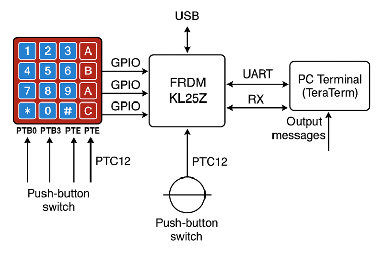
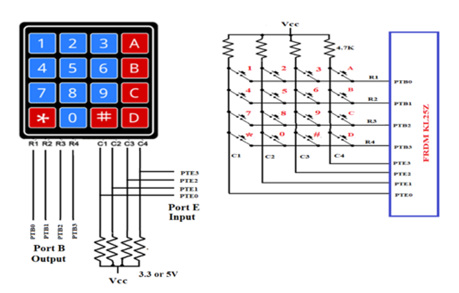
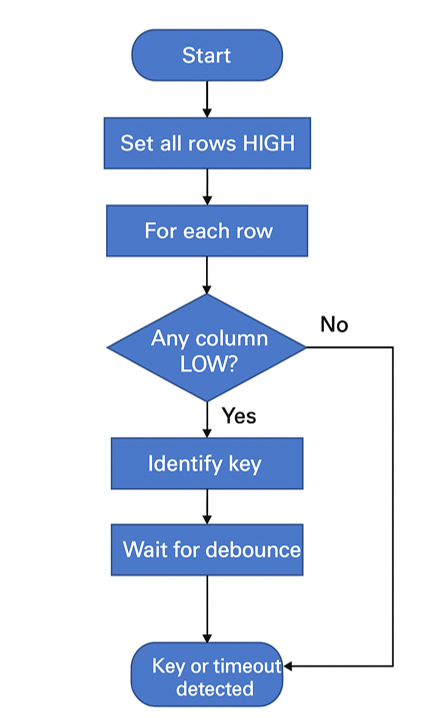
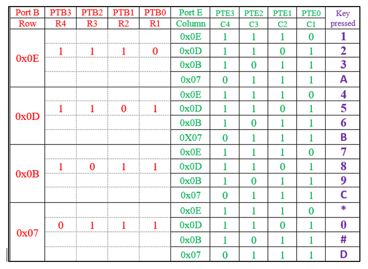

# Microcontroller ATM System

Microprocessor-based ATM simulation implemented on the FRDM-KL25Z development board using keypad input, UART communication, timeout handling, and transaction validation logic.

> Embedded systems project focused on GPIO interfacing, keypad scanning, UART feedback, and state-based transaction control on a real microcontroller board.

<p align="center">
  
</p>

---

## Project Snapshot

| Area | Details |
|---|---|
| Board | FRDM-KL25Z |
| Language | C |
| Input | 4x4 matrix keypad and push button |
| Output | UART serial terminal |
| Core logic | PIN validation, balance checks, retry limits, timeout handling |
| Focus | Low-level embedded control and reliable user interaction |

# Overview

This project implements a simplified ATM system using the FRDM-KL25Z microcontroller platform.

The system supports:

- PIN authentication
- Keypad-based user input
- UART terminal communication
- Withdrawal amount validation
- Timeout protection
- Transaction retry handling

The project demonstrates low-level embedded systems programming using GPIO interfaces, UART peripherals, keypad scanning logic, and transaction-state management.

---

# Hardware Interface

<p align="center">
  
</p>

The ATM system integrates:

- FRDM-KL25Z development board
- 4x4 matrix keypad
- UART serial terminal
- Push-button input

The keypad is used for:
- PIN entry
- Withdrawal amount input
- Transaction interaction

---

# Keypad Scanning Algorithm

<p align="center">
  
</p>

The keypad scanning mechanism operates using:

- row-column activation
- GPIO polling
- debounce handling
- timeout-based key detection

Each keypad row is sequentially driven LOW while the column pins are monitored to detect active key presses.

---

# Key Detection Logic

<p align="center">
  
</p>

The system translates row-column combinations into corresponding keypad characters used for:
- PIN validation
- Withdrawal amount entry
- User interaction control

---

# ATM Transaction Workflow

The ATM workflow performs:

1. Button-triggered transaction start
2. PIN entry using keypad input
3. PIN verification
4. Withdrawal amount entry
5. Balance validation
6. Transaction confirmation or rejection

The implementation includes:
- incorrect PIN handling
- retry limits
- timeout protection
- transaction abort logic

---

# Performance Evaluation

| Test Scenario | Expected Result |
|---|---|
| Correct PIN and withdrawal <= 5000 | Transaction success |
| Correct PIN and withdrawal > 5000 | Insufficient balance |
| Wrong PIN on first try, correct second | Retry message, then successful validation |
| Wrong PIN three times | Incorrect Pin. Aborted! |
| No PIN input within timeout | Timeout!! |
| No withdrawal input within timeout | Timeout!! |

The system was validated across multiple transaction scenarios to verify:
- keypad reliability
- UART communication
- timeout handling
- transaction-state correctness

---

# Engineering Highlights

- Built a reliable keypad scanner using row-column GPIO polling.
- Managed user interaction through a finite-state transaction workflow.
- Added timeout protection so the system does not block indefinitely while waiting for input.
- Validated edge cases such as invalid PIN attempts, insufficient balance, and aborted transactions.

---

# Features

- 4x4 keypad scanning
- UART communication
- PIN authentication
- Withdrawal validation
- Timeout protection
- Transaction retry logic
- GPIO peripheral programming
- Embedded transaction workflow

---

# Source Code

```text
src/
├── atm_main.c
└── README.md
```

The implementation includes:
- UART initialization
- GPIO configuration
- keypad scanning logic
- timeout-based input handling
- transaction validation
- ATM workflow control

---

# Technologies Used

## Embedded Systems

- C
- FRDM-KL25Z
- GPIO Programming
- UART Communication
- Matrix Keypad Scanning

## Embedded Concepts

- Polling
- Debouncing
- Timeout Logic
- State-Based Control
- Peripheral Initialization

---

# Results

| Metric | Result |
|---|---|
| Platform | FRDM-KL25Z |
| Input Method | 4x4 Matrix Keypad |
| Communication | UART |
| PIN Verification | Implemented |
| Timeout Protection | Implemented |
| Transaction Validation | Implemented |

---

# Key Engineering Concepts

- Embedded systems programming
- GPIO interfacing
- UART communication
- Keypad scanning
- Finite-state transaction control
- Timeout handling
- Debouncing
- Peripheral configuration

---

# Documentation

- [Full Technical Report](docs/microprocessor_atm_report.pdf)

---

# Authors

- Hasan Al Hussein
- Yaman Masad
- Salaheddine Metnani 

Khalifa University
